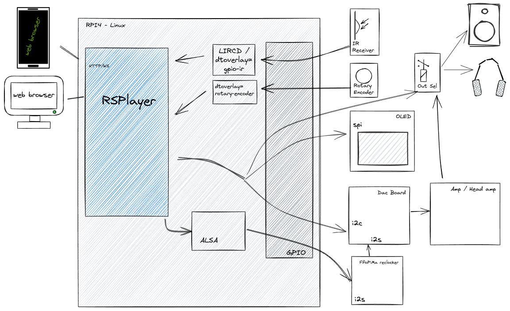

# RSPlayer
RSPlayer is an open-source music player software that allows you to play audio files from you local storage, internet radio streams or Spotify. It executes as a service and provides a web user interface on port 80.

### Detailed documentation -> https://ljufa.github.io/rsplayer/

## Installation
To install RSPlayer, execute the following script (requires curl):
```bash
bash <(curl -s https://raw.githubusercontent.com/ljufa/rsplayer/master/install.sh)
```
The installation script will install all the necessary files, configure the systemd service, and start the service.

To stop the RSPlayer service, run the following command:
```bash
sudo systemctl stop rsplayer
```
To start the RSPlayer service again, run the following command:
```bash
sudo systemctl start rsplayer
```
## Run as docker container
```bash
docker run -p 8000:80 -v /media/samsung/MUSIC:/music -v rsplayer_data:/opt/rsplayer --device /dev/snd -it --rm ljufa/rsplayer:latest       
```
or [docker compose](docker-compose.yaml)
```yaml
version: "3"
services:
  rsplayer:
    image: ljufa/rsplayer:latest
    devices:
      - /dev/snd
    ports:
      - 8000:80
    volumes:
      - ${MUSIC_DIR}:/music:ro
      - 'rsplayer_volume:/opt/rsplayer'
    restart: unless-stopped
volumes:
  rsplayer_volume:
    driver: local

```

## Usage
Once RSPlayer is installed, you can access the web user interface by navigating to http://localhost or the IP address of the machine on which it is installed. From the web user interface, you can finish configuration following steps described [here](https://ljufa.github.io/rsplayer/#/?id=basic-configuration).

For minimal working configuration it is required to select *Audio interface*, *PCM device*, *Music directory path* followed by *Full scan*.

## Features
* Basic player features: play, next, prev, volume control
* RSP, MPD or Spotify player controls: play, pause, next, prev, toggle shuffle
* View, manage, search playback queue
* Browse static and dynamic playlists
* Software volume control by Alsa

Optionaly with additional hardware devices it provides:
* Hardware volume control by DAC chip
* Infrared remote control: Play, Pause, Next, Prev, Volume Up/Down, Poweroff
* Volume control using knob/rotary encoder
* Oled display for song and player info
* Switch audio output between speakers and headphones
* Change DAC settings: digital filter, gain, sound profile

 ## Hardware requirements
Mandatory:
* x86(Amd64) or Arm(64 and 32bit) computer with debian based linux distribution installed.

Optionaly if you use SBC with Gpio header you can connect and use following devices:
* Diy friendly AK44xx DAC board i.e. [Diyinhk](https://www.diyinhk.com/shop/audio-kits/), [JLSounds](http://jlsounds.com/products.html) ...
* USB to I2S converter board. i.e. [WaveIO](https://luckit.biz/), [Amanero](https://amanero.com/), [JLSounds](http://jlsounds.com/products.html) ...
* Infrared Receiver TSOP312xx. i.e. [TSOP31238](https://eu.mouser.com/ProductDetail/Vishay-Semiconductors/TSOP31238?qs=5rGgbCH0pB1jaK4I0GvRsw%3D%3D)
* A1156 Apple Remote Control
* Oled display ST7920 128x64 (from Amazon, Ebay ...)
* Rotary Encoder (from Amazon, Ebay ...)
* Headphone Amp board i.e. [Whammy](https://diyaudiostore.com/products/whammy-completion-kit?_pos=3&_sid=bf6542f23&_ss=r)
* Power Supply
* Metal Case

## Contributing
If you would like to contribute to RSPlayer, please submit a pull request or open an issue on the GitHub repository.

## License
RSPlayer is licensed under the MIT license. See the LICENSE file for more information.

## Demo videos
[](https://youtu.be/S-LKkZeLEQ0)
[](https://youtu.be/kH-_5-JRHrw)
[](https://youtu.be/biqSZ9TTWOg)


## Architecture

## My Audio Streamer Implementation
**[KiCad files](docs/kicad/)** could be found here


